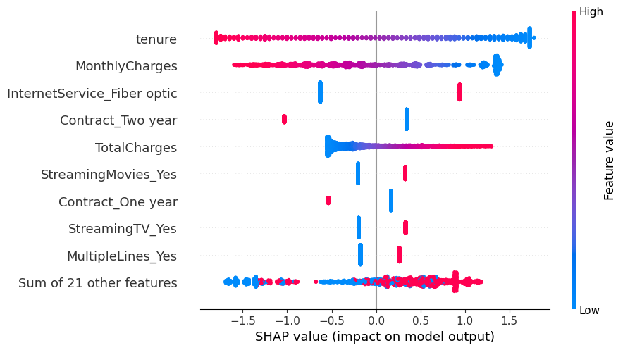

# 📈 Customer Churn Prediction with Explainable AI
Predict telecom customer churn using Machine Learning and Explainable AI (XAI). This project uses scikit-learn, XGBoost, SHAP, Streamlit, and more to build, explain, and deploy a churn prediction system.

## 🚀 Features
✅ End-to-end machine learning pipeline  
✅ Exploratory Data Analysis (EDA)  
✅ Feature engineering and selection  
✅ Churn prediction models (Logistic Regression, Random Forest, XGBoost)  
✅ Explainable AI using SHAP values  
✅ Interactive Streamlit app for predictions & explanations  
✅ Modular code and organized folder structure

## 📁 Folder Structure
```
customer-churn-prediction/
├── data/
│   ├── WA_Fn-UseC_-Telco-Customer-Churn.xlsx      # Raw dataset
│   └── cleaned_telco_data.csv                     # Cleaned dataset
│
├── models/
│   ├── churn_model.pkl                            # Serialized best model
│   └── scaler.pkl                                 # Serialized scaler
│
├── reports/
│   ├── *.png                                      # All EDA plots (distributions, correlations, etc.)
│
├── explainability_reports/
│   ├── shap_summary.png                           # SHAP summary plot
│   ├── shap_waterfall_instance_5.png              # SHAP waterfall for instance 5
│   └── lime_explanation_instance_5.html           # LIME explanation HTML
│
├── src/
│   ├── __init__.py                                # Package metadata, logger setup
│   ├── data_preprocessing.py                      # Data loading and cleaning
│   ├── eda.py                                     # Exploratory Data Analysis
│   ├── train_model.py                             # Model training and evaluation
│   ├── explainability.py                          # SHAP and LIME explanations
│   └── utils.py                                   # Utility functions for model ops and metrics
│
├── README.md                                      # Project overview and instructions
└── requirements.txt                               # Dependencies list

```

## 📝 Dataset
- **Telco Customer Churn Dataset**  
Contains customer demographics, account info, service usage & churn labels.

| Feature Examples         | Description                        |
|---------------------------|-----------------------------------|
| `gender`, `SeniorCitizen` | Customer demographics             |
| `tenure`, `MonthlyCharges`| Account details                   |
| `InternetService`, `Contract` | Service usage               |
| `Churn`                   | Target variable (Yes/No)           |

## ⚙️ Installation & Setup
1️⃣ **Clone the repository**
```bash
git clone https://github.com/yourusername/customer-churn-prediction.git
cd customer-churn-prediction
```
2️⃣ **Create virtual environment & activate**
```bash
python -m venv .venv
# On Windows
.venv\Scripts\activate
# On macOS/Linux
source .venv/bin/activate
```
3️⃣ **Install dependencies**
```bash
pip install -r requirements.txt
```
4️⃣ **Run preprocessing & training pipeline**
```bash
python run_pipeline/run_pipeline.py
```
This produces `models/churn_model.pkl`, `models/scaler.pkl`, and
`models/feature_schema.json` — the app needs all three and won't start without them.

5️⃣ **Launch Streamlit app**
```bash
streamlit run app/app.py
```
Run this from the repository root (not from inside `app/`).

## 🏗️ Usage
### 🔍 Predict churn
- Open the Streamlit app on `http://localhost:8501`.
- Use the sidebar to either upload a CSV for batch predictions, or switch to
  **Manual Input Form** in the sidebar navigation to enter one customer's details.
  Predictions update live as you change inputs (there's no separate "Predict" button).

### 📊 Explain predictions
- Both modes show a SHAP plot (summary/beeswarm for batch, waterfall for a single
  customer) alongside the prediction.

## 💡 Examples
| Customer Details                      | Prediction       | Top Feature Impacts            |
|--------------------------------------|------------------|--------------------------------|
| `tenure=1, MonthlyCharges=85`         | **Likely to churn** | High charges, short tenure   |
| `tenure=60, MonthlyCharges=30`        | **Not likely**     | Loyal, low charges            |

Sample SHAP output:



## 🔥 Technologies Used
- **Python** (pandas, numpy, scikit-learn, xgboost, shap, matplotlib, seaborn)
- **Streamlit** for interactive UI
- **Pickle** for model serialization
- **VS Code / PyCharm** for development

## 🚀 Future Enhancements
- Hyperparameter tuning using Optuna
- Model comparison dashboard
- Automated data drift checks
- Docker deployment
- CI/CD pipeline with GitHub Actions

## 🤝 Contributing
💡 Contributions are welcome!  
- Fork the repo & create a branch: `git checkout -b feature/your-feature`
- Commit your changes: `git commit -m 'Add new feature'`
- Push to the branch: `git push origin feature/your-feature`
- Open a pull request 🚀

## 📜 License
This project is open-sourced under the [MIT License](LICENSE).

## 🙌 Acknowledgments
- [Kaggle Telco Churn Dataset](https://www.kaggle.com/blastchar/telco-customer-churn)
- [SHAP by Scott Lundberg](https://github.com/slundberg/shap)

## ✉️ Contact
If you have any questions or suggestions, feel free to reach out:  
📧 **Narendran L** — `narendranlofficial@gmail.com`
